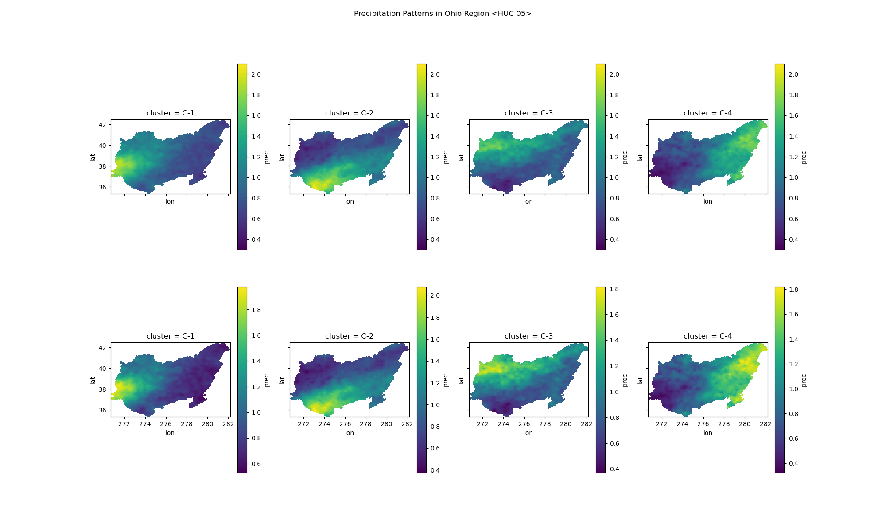
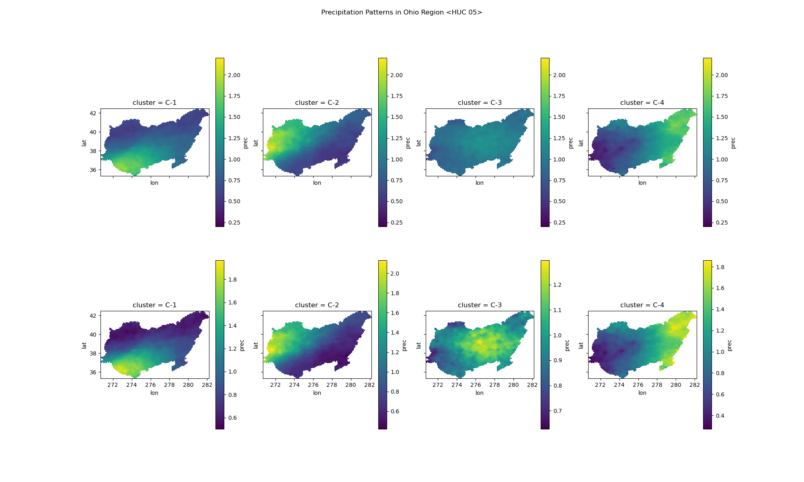

# locus

Identifies spatial patterns in extreme precipitation events.

## Preparing Datasets
### Precipitation Data
Livneh datasets can be downloaded from: https://psl.noaa.gov/thredds/catalog/Datasets/livneh/metvars/catalog.html

Example link: https://psl.noaa.gov/thredds/fileServer/Datasets/livneh/metvars/prec.1915.nc
Data is available from 1915 to 2011.

There is a download script (bash) that'll download the files for you in `data` directory, you need gnu parallel and curl for downloads, if you don't then it'll generate the links in the file `data/livneh-files.txt`, you can download it using your favourite download manager.

### Water Boundary Data
Download the watershed boundaries from [USGS TNM Download (v2.0)](https://apps.nationalmap.gov), [direct link](https://prd-tnm.s3.amazonaws.com/StagedProducts/Hydrography/WBD/National/GPKG/WBD_National_GPKG.zip).

It's 4.8 GB to download and 7.1 GB after you unzip it.

## Running the program
The program has all the source codes inside the `src` directory, you can run it with `python`.

First install the requirements in `requirements.txt`

    pip install -r requirements.txt

Then download the input files for Water Boundary Dataset and Livneh Dataset. See instructions above.

Run the CLI program with python

    python -m src.locus -h

Will give you the usage instructions

    usage: locus [-h] [-n NUM_DAYS] [-l] [-d] [-D] [-s {ams,pds,both}] [-c] [-e] [-a] [-p] [-b] HUCode

    Analyse extreme precipitation pattern

    positional arguments:
      HUCode

    options:
      -h, --help            show this help message and exit
      -n NUM_DAYS, --num-days NUM_DAYS
                            Number of Days for ams/pds event
      -l, --list-hucs       List HUCodes in the given category and exit
      -d, --details         print basin details before processing
      -D, --details-only    print basin details and exit
      -s {ams,pds,both}, --series {ams,pds,both}
                            ams or pds event to plot
      -c, --calculate-weights
                            run the calculate_weights function
      -e, --extract-annual-timeseries
                            run the extract_annual_timeseries function
      -a, --ams-and-pds     run the ams_and_pds function
      -p, --plot-clusters   run the plot_clusters function
      -b, --batch-process   run the batch_process function

    https://github.com/Atreyagaurav/locus-code-usace

For example:

to run all the process for HUCode 02, for single day precipitation event:

    python -m src.locus 02 -d -b -n 1

to list all HUC2 basins:

    python -m src.locus 2 -l

## Example Output
For Ohio Region (HUC 05)

Clusters from AMS:

Clusters from PDS:

## Output Files

The program creates a directory with the HUCode as the name inside the `data/output` for data files (`.csv`, `.nc`, etc), and makes a directory with HUCode as name in the `images` for the plots (`.png`).

The files generated by each functions are discussed below.

### calculate-weights
Files: `ids-and-weights.nc,ids.csv`

Ids and Weights for each cells in the Livneh Dataset cropped to the given basin.

### extract-annual-timeseries
Files: `prec.YYYY.csv` (where YYYY is year from 1915-2011)

Daily timeseries of the basin averaged precipitation data for each year.

### amd-and-pds
Files: `{ams,pds}_Ndy_{series,grids}.csv` where N is the `num_days` (duration of event considered)

AMS and PDS events for that basin for all the years. `_series.csv` has the basin averaged precipitation, while `_grids.csv` has the values of the precipitation in the grids inside the basin.

PDS is calculated with threhold value of minimum precipitation value of AMS events.

### plot-clusters
Files: `{ams,pds}_Ndy.png` where N is the `num_days` (duration of event considered)

Plot of the clusters made from the events data for the AMS list or PDS list. The images show clusters with individual scale on bottom, and global scale on top for comparision.

## Run Times
This is the runtime on Trinity (HUCode: 1203) on my laptop (CPU: AMD Ryzen 7 6800U with Radeon Graphics (16) @ 2.700GHz).

On the first run, where it has to calculate everything:

    *** CALCULATE_WEIGHTS
        Time taken:  2.290 seconds ( 0.038 minutes)
    *** EXTRACT_ANNUAL_TIMESERIES
        Time taken:  86.598 seconds ( 1.4 minutes)
    *** AMS_AND_PDS
        Time taken:  23.125 seconds ( 0.39 minutes)
	*** PLOT_CLUSTERS
	    Time taken:  3.401 seconds ( 0.057 minutes)

And then on the subsequent runs:

    *** CALCULATE_WEIGHTS
        Time taken:  0.002 seconds ( 2.9e-05 minutes)
    *** EXTRACT_ANNUAL_TIMESERIES
        Time taken:  0.075 seconds ( 0.0013 minutes)
    *** AMS_AND_PDS
        Time taken:  0.192 seconds ( 0.0032 minutes)
    *** PLOT_CLUSTERS
        Time taken:  3.503 seconds ( 0.058 minutes)

For North Branch Potomac (HUCode: 02070002) first runtime are as follows:

    *** CALCULATE_WEIGHTS
        Time taken:  0.104 seconds ( 0.0017 minutes)
    *** EXTRACT_ANNUAL_TIMESERIES
        Time taken:  83.067 seconds ( 1.4 minutes)
    *** AMS_AND_PDS
        Time taken:  9.011 seconds ( 0.15 minutes)
    *** PLOT_CLUSTERS
        Time taken:  2.308 seconds ( 0.038 minutes)

For Mid Atlantic Region <HUC 02>

    *** CALCULATE_WEIGHTS
        Time taken:  64.774 seconds ( 1.1 minutes)
    *** EXTRACT_ANNUAL_TIMESERIES
        Time taken:  91.243 seconds ( 1.5 minutes)
    *** AMS_AND_PDS
        Time taken:  22.159 seconds ( 0.37 minutes)
	*** PLOT_CLUSTERS
        Time taken:  22.557 seconds ( 0.38 minutes)

For Ohio Region <HUC 05>

    *** CALCULATE_WEIGHTS
        Time taken:  128.020 seconds ( 2.1 minutes)
    *** EXTRACT_ANNUAL_TIMESERIES
        Time taken:  91.441 seconds ( 1.5 minutes)
    *** AMS_AND_PDS
        Time taken:  18.734 seconds ( 0.31 minutes)
    *** PLOT_CLUSTERS
        Time taken:  32.160 seconds ( 0.54 minutes)

Seems like the extraction part is similar for all the basins, but the other ones vary by size. But it's reasonable time if you want to process a lot of basins.

# Tips and tricks
## Running in parallel
The original plan was to run everything without multiprocessing in the module itself, so multiple basins could be processed in parallel, but there seems to be some problem with the reading of netCDF from xarray or something that is giving some troubles. will have to look at it.

The plan is to use the `--list-hucs` command to get a list of codes for all basins, and then run the batch processing in parallel for them.

## Remore extra paddings for plots
The plots are a little weird, and I'm not that familiar with matplotlib, it seems to have a lot of extra border specially since we don't know how many clusters will be there, so I use `imagemagick` to trim the borders.

Here this example command will remove the excess padding and then add 20x20 padding on all sides

    mogrify -trim +repage -bordercolor white -border 20x20  images/02/*
## Generating reports
The output of the command can be piped, only the reporting texts from the main function of the `src/locus.py` is output to the `stdout`. The piped contents are in `emacs-org` format, which can be exported to any other formats (html,latex,pdf,etc) with emacs, if you do not have emacs you can use `pandoc` to convert it. Or you can modify the code to print markdown syntax instead, the output is simple so you only have to change all `"*"` in headings to `"#"`.

If you need to print any debugging information that's not supposed to goto the report, print it in the `stderr`.

# Note
The time reported can include other steps than the one you asked it to do, if that is needed. For example, if you asked for extracting the timeseries, then it'll calculate the weights if there is no weights, or if you ask for `ams/pds` it'll extract the timeseries.
